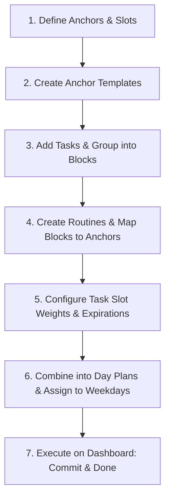

# to_live — System Configuration & Instruction Manual

This manual provides a step-by-step walkthrough for configuring the **to_live** scheduler. It details how to set up your day's skeleton, define tasks, group them into blocks, schedule routines, and execute your day using the Dashboard.

---

## The Core Lifecycle

---

## Step-by-Step Configuration Guide

### 1. Populate Anchors
* **Concept**: **Anchors** are fixed boundary markers in your day (e.g., waking up, starting work, going to sleep). They have no fixed times by themselves; they simply mark transition points.
* **UI Walkthrough**: Go to the **Manage** tab → **Anchors** sub-panel.
* **Example**:
  * `Wake` (Marks the start of the morning)
  * `Work Start` (Marks the start of the workday)
  * `Work End` (Marks the wrap-up of the workday)
  * `Sleep` (Marks the end of the day)

### 2. Populate Slots
* **Concept**: **Slots** are the periods of time *between* anchors. Tasks belong to blocks, and blocks are assigned to slots.
* **UI Walkthrough**: Go to the **Manage** tab → **Slots** sub-panel.
* **Example**:
  * `Morning` (Starts at `Wake`)
  * `Work Hours` (Starts at `Work Start`)
  * `Evening` (Starts at `Work End`)
  * `Night` (Starts at `Sleep`)

### 3. Populate Anchor Templates
* **Concept**: An **Anchor Template** ties everything together by assigning specific times (spike times) to your anchors and mapping slots to those anchors.
* **UI Walkthrough**: Go to the **Manage** tab → **Templates** sub-panel. Click **New Template**.
* **Example ("Standard Workday")**:
  | Anchor | Spike Time | Starts Slot |
  | :--- | :--- | :--- |
  | `Wake` | `07:00 AM` (420 mins) | `Morning` |
  | `Work Start` | `09:00 AM` (540 mins) | `Work Hours` |
  | `Work End` | `05:30 PM` (1050 mins) | `Evening` |
  | `Sleep` | `11:00 PM` (1380 mins) | `Night` |

### 4. Add Tasks
* **Concept**: A **Task** is a quantum of time consumption. Every task must have a duration (it cannot shrink; it either happens or gets pushed/dropped) and a baseline weight.
* **UI Walkthrough**: Go to the **Manage** tab → **Tasks** sub-panel. Click **New Task**. Toggle Knobs to add advanced configurations:
  * **Is Mother**: Allows linking to child tasks (active sequential links or passive background/ghost links).
  * **Has Weight Curve**: Allows defining a 24-hour weight curve (circular weight over time of day).
  * **Has Expiry**: Destroys the task after a specific absolute date-time.
* **Example**:
  * `Brush & Wash` (Duration: `10m`, Weight: `100`)
  * `Morning Tea & Book` (Duration: `20m`, Weight: `40`)
  * `Review Github PRs` (Duration: `30m`, Weight: `80`)
  * `Coding Session` (Duration: `120m`, Weight: `90`)
  * `Gym Workout` (Duration: `60m`, Weight: `70`)
  * `Evening Wind-down` (Duration: `30m`, Weight: `50`)

### 5. Add Task Blocks
* **Concept**: A **Block** is an ordered group of tasks.
* **UI Walkthrough**: Go to the **Manage** tab → **Blocks** sub-panel. Click **New Block**. Add tasks and configure them:
  * **Order**: Re-arrange sequence.
  * **Is Background (bg)**: Run concurrently with subsequent active tasks (doesn't consume sequential time).
* **Example ("Morning Block")**:
  1. `Brush & Wash` (Active, Order 0)
  2. `Boil Water / Brew Tea` (Background, Order 1) — *runs while doing the next tasks!*
  3. `Morning Tea & Book` (Active, Order 2)

### 6. Add Routines
* **Concept**: **Routines** are wrappers that recurringly spawn blocks of tasks daily or weekly.
* **UI Walkthrough**: Go to the **Manage** tab → **Routines** sub-panel. Click **New Routine**.

### 7. Add Blocks and Set the Anchors
* **Concept**: Assign your task blocks to specific anchors within the routine.
* **UI Walkthrough**: In the **Routine Editor**, look at the **Block Configs** section. Click **Add Block Config**.
* **Example**:
  * Map `Morning Block` → `Wake` anchor
  * Map `Work Block` → `Work Start` anchor
  * Map `Evening Block` → `Work End` anchor

### 8. Configure Tasks Inside the Routine
* **Concept**: Fine-tune how individual tasks behave within the routine using the **Configure Tasks** options.
  * Set a task's slot weight curves to specify its priority relative to the start of a slot (e.g. Morning vs Work Hours).
  * **Dynamic Anchor Pushing**: Routines push anchors downstream. If tasks under `Wake` (Morning slot) take longer than expected and overflow into `Work Start`, the scheduler pushes the `Work Start` anchor forward *until all active, non-skipped tasks mapped to the Morning slot are marked done or skipped*.
* **UI Walkthrough**: In the **Routine Editor**, expand the **Configure Tasks** dropdown. Select a task to customize:
  * **Fallback Weight**: Baseline weight for any slots not explicitly defined (default is 0, which means it won't schedule in other slots).
  * **Ideal Time**: Set preferred minutes from midnight (e.g., `10:00 AM`).
  * **Slot Weights**: Define relative weight curves for specific slots. E.g., make `Coding Session` highly prioritized during the `Work Hours` slot, but drop it to `0` priority during `Evening`.

### 9. Set Expiry from Anchor Start
* **Concept**: Define how long a task remains valid after its anchor triggers. This is useful for time-sensitive tasks that should be dropped (expired) if not completed in time (e.g. breakfast expires 2 hours after waking up).
* **UI Walkthrough**: Under **Configure Tasks** in the Routine Editor, set **Expires After (Minutes)**.
* **Example**:
  * Set `Morning Tea & Book` to expire `120 minutes` after `Wake` triggers. If it gets pushed past 9:00 AM, it is automatically removed/hidden from the active timeline to avoid cluttering your workday.

### 10. Go to Day Planner and Create Day Plans
* **Concept**: A **Day Plan** packages an **Anchor Template** with a set of active **Routines**.
* **UI Walkthrough**: Go to the **Manage** tab → **Day Planner** sub-panel. Click **New Day Plan**.
* **Example ("Standard Workday Plan")**:
  * **Anchor Template**: `Standard Workday`
  * **Routines**: `[Daily Habits, Work Routine]`

### 11. Add Days to Weekday Planner
* **Concept**: Assign your day plans to specific days of the week.
* **UI Walkthrough**: In the **Day Planner** sub-panel, find the **Weekday Planner** section.
* **Example**:
  * `Monday` - `Friday`: `Standard Workday Plan`
  * `Saturday` - `Sunday`: `Weekend Relaxation Plan`

---

## Daily Execution on the Dashboard

### 12. View the Dashboard
* Navigate to the **Dashboard** tab. The scheduler resolves your constraints and shows your sequential timeline from top to bottom. Bold lines mark your anchor transitions.

### 13. Commit Tasks (`▶ Commit`)
* **Concept**: Snippets the start time of the task to the current virtual time.
* **Why**: It locks the task start time (`🔒`), preventing downstream schedule shifts from changing your current task's start time while you are working on it. Remaining duration is calculated relative to this committed start time.
* **How**: Click **▶ Commit** on the current active task. Click **⏹ Uncommit** to unlock it.

### 14. Mark Tasks Done (`Done`)
* **Concept**: Marks the task as completed, records the finish timestamp, and shifts remaining tasks up.
* **How**: Click **Done** on the task. A time picker will open, defaulting to your virtual time slider. Confirm the completion time.

### 15. Adjust Weights to Reprioritize
* **Concept**: The scheduler is weight-driven. If you want a task to appear earlier in a slot, increase its weight. If you want to delay it, decrease its weight.
* **How**: Go to **Manage** → **Tasks** and edit the task's weight (or define a custom slot weight curve in the Routine).

### 16. Use Ad-hoc Tasks
* **Concept**: Add random, one-off tasks directly onto today's timeline.
* **How**: On the Dashboard, click the **+ Ad-hoc** button (or **Add Ad-hoc Task**). Enter a title, duration, slot, and priority. The scheduler instantly recalculates and inserts it.

### 17. Clone Routine Tasks to Ad-hoc
* **Concept**: If a routine task needs to be moved around or rescheduled independently without changing the core routine, convert it into an ad-hoc task.
* **How**: On the Dashboard, click the **Clone as ad-hoc** (or **Edit ad-hoc**) option next to a routine task. Once cloned, you can edit its weight, duration, or slot override freely without affecting future recurrences.
